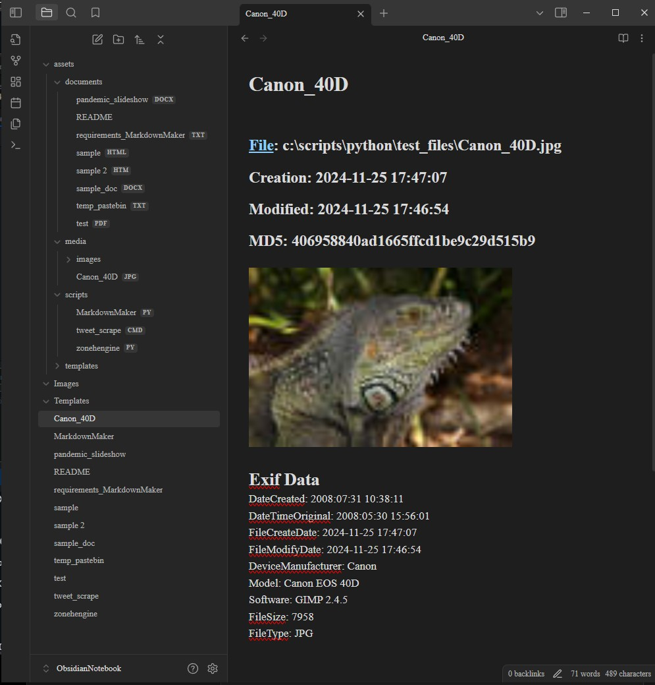
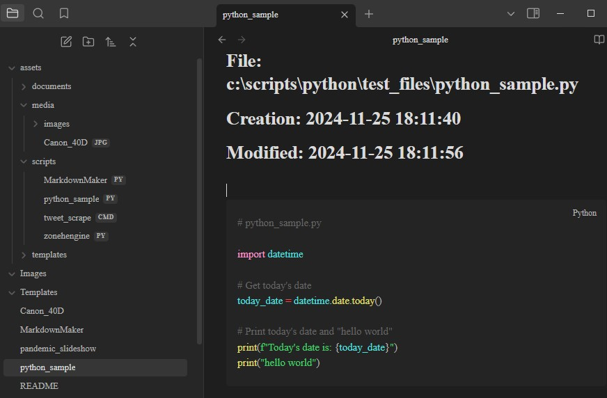
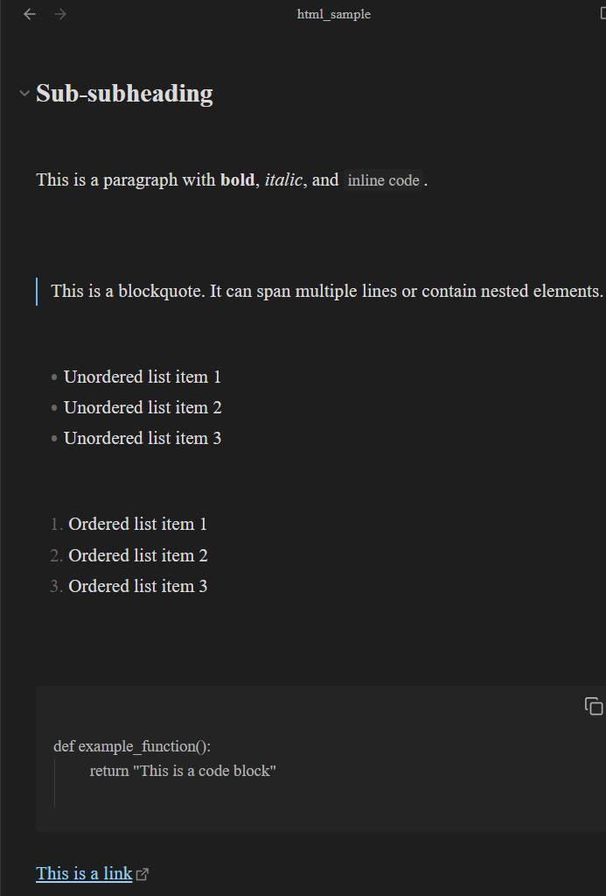
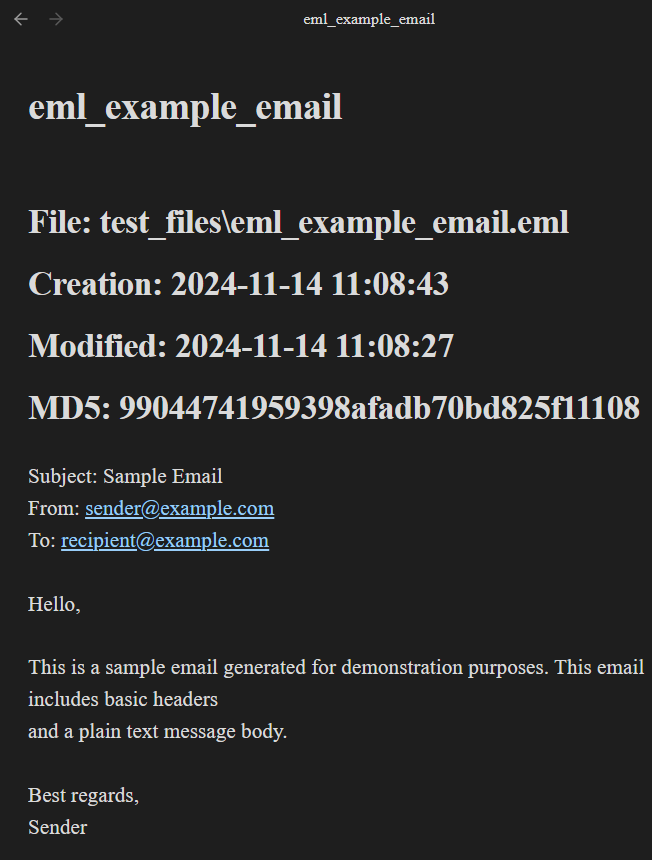

# MarkdownMaker (MarkdownMaker.py)
Convert documents and files into unified markdown files for use with Obsidian, Notion, Gitub Readme's and other Markdown notebooks.

## installation:

pip install -r requirements_MarkdownMaker.txt

## directions:
pick a folder with files and even subfolders with a variety of different filetypes. 

## options:

h, --help            show this help message and exit

I INPUT folder path (default = current working directory)

O OUTPUT folder path (default = ObsidianNotebook)

c, --convert         Convert files to markdown

b, --blank           create a blank obsidian folder

  
## Usage:


```
python MarkdownMaker.py -c (from command prompt) 
```

## Example
```
python MarkdownMaker.py -c -I c:\scripts\python\test_files -O c:\scripts\python\ObsidianNotebook
```


create a blank obsidian folder with default folders and settings
```
python MarkdownMaker.py -b 
```
## help

```

python MarkdownMaker.py -H
```


Supported images with exif data will have that displayed under the image





Scripts will be added to the scripts folder and get added markup language for scripts like python




 
Documents will be added to the documents folder and get added markup language for files like .pdf, .html, .docx, .rtf and more.
There is often a link to the orginal file.

html sample




eml sample




